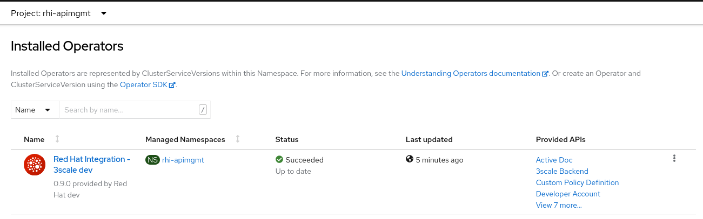
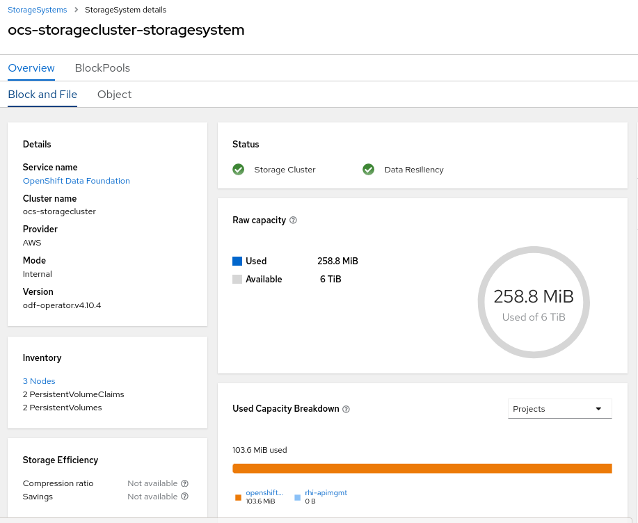

:gitdomain: redhat-na-ssa

= 3scale Early Adopter Deployment

:numbered:

== Overview
Red Hat is offering an Early Adopter program to select partners and customers for the 2.12 release of the 3scale API Manager.

Of critical importance in this release is the ability to run the link:https://issues.redhat.com/browse/THREESCALE-5725[API Manager in a FIPS enabled] OpenShift cluster.

The container images for the beta release of the API Manager are managed in a private `quay.io` organization.
This document will guide you through the procedure to access these beta release images and provision the API Manager.

=== Release & Support Details

*18 June 2022*

. FIPs work has been carried out in parallel with the 2.12 release (with the QE phase at the end of 2.12 at least).
. 2.12 has been close to release for a few weeks but we have found late bugs that needed fixing.
. 2.12 will GA very soon, but without FIPS. We will shift our focus to FIPs (QE testing, docs etc) and follow-up 2.12 with a FIPs compatible release as quickly as possible. 

. In the interim we will finish validating the FIPs alpha, fix some known issues in it and then produce a CR.

. Support exceptions to use that CR release (prior to 2.13 with FIPs going GA) will be very few.

. *It's highly recommended that the purpose of installation of a CR release of API Manager be for demo and/or test only!!!!  Do not expect to use in production nor expect to receive production support from Red Hat using this candidate release.*

. *If you are a Red Hat SA or consultant, you should be preparred to support your customers / partners with this CR release.*

=== Known Issues

. link:https://issues.redhat.com/browse/THREESCALE-5725?focusedCommentId=20467709&page=com.atlassian.jira.plugin.system.issuetabpanels%3Acomment-tabpanel#comment-20467709[THREESCALE-5725]
.. Markdown pages in dev portal probably don't work
.. avatars, invoices and other attachments stored in S3 (I have a hope for this at least, but is a risk area)
.. some ActiveMerchant payment gateways require MD5 so they may fail

== Pre-requisites

. OpenShift Minimum Requirements:
.. *Version*:  4.10
.. *RAM*:  48 GB
.. *CPU*:  16 cores
.. *Filesystem*:
... 5 PVCs of 5 GBs each of RWO
... 1 PVC of 5 GBs of RWX
+
NOTE:  18 June 2022:  Use of AWS S3 is problematic.  Please use _Openshift Data Foundations_ operator (or some other solution ) to create RWX storage systems.

.. *FIPS enabled*
+
NOTE: The appendix of this document includes a short tutorial on how to validate FIPS enablement of your OCP cluster.

.. *Suggested*:  wildcard certificate from known Certificate Authority (ie: LetsEncrypt) for application routes exposed through OpenShift

. Credentials to private _quay.io:443/3scale_ registry

.. Contact your Red Hat NAPS SA for the credentials to the private quay.io image repository.

.. Based on the credentials provided, set the following environment variables in your shell:
+
-----
export PRIVATE_QUAY_ACCOUNT_NAME="CHANGE_ME"
export PRIVATE_QUAY_ACCOUNT_PASSWORD="CHANGE_ME"
-----

== Procedure

=== New namespace

Start by creating a new namespace where your 3scale API Manager will be deployed to.

. Create _rhi-apimgmt_ project
+
-----
$ oc new-project rhi-apimgmt
-----

=== OpenShift Pull Secret
. Download your existing OpenShift pull-secret to a temp file called _private-quay-enabled-pull-secret.json_:
+
-----
$ oc get secret/pull-secret \
            -n openshift-config \
            --template='{{index .data ".dockerconfigjson" | base64decode}}' \
            > /tmp/private-quay-enabled-pull-secret.json
-----

. Add credentials of private quay image repository account to pull secret:
+
-----
$ oc registry login --registry="quay.io:443/3scale" \
        --auth-basic="$PRIVATE_QUAY_ACCOUNT_NAME:$PRIVATE_QUAY_ACCOUNT_PASSWORD" \
        --to=/tmp/private-quay-enabled-pull-secret.json
-----

. Update pull secret for your OpenShift cluster:
+
-----
$ oc set data secret/pull-secret \
        -n openshift-config \
        --from-file=.dockerconfigjson=/tmp/private-quay-enabled-pull-secret.json
-----

. Verify your cluster pull-secret now contains two references to quay image repositories (similar to the following) :
+
-----
$ oc get secret/pull-secret \
    -n openshift-config \
    --template='{{index .data ".dockerconfigjson" | base64decode}}' \
    | jq -r '.auths|to_entries | .[]|select(.key | contains("quay.io"))'

{
  "key": "quay.io",
  "value": {
    "auth": "xxxxxxxxxxxxxxxxxxxx",
    "email": "rhpds-admins@redhat.com"
  }
}
{
  "key": "quay.io:443/3scale",
  "value": {
    "auth": "xxxxxxxxxxxxxxxxxx"
  }
}
-----

. Optional:  Copy _pull-secret_ to _rhi-apimgmt_ namespace:
+
With OpenShift 4.10, its been observed that the _pull-secret_ needs to be included in the _rhi-apimgmt_ namespace:
+
-----
$ oc get secret pull-secret --namespace=openshift-config -o yaml | sed 's/namespace: .*/namespace: rhi-apimgmt/' | oc apply -f -
-----

. With this pull-secret in place, your OCP cluster will now be able to pull images such as the following:
+
-----
quay.io:443/3scale/rh-3scale-operator-index:3scale.alpha.4.8
-----

=== Custom ImageContentSourcePolicy

. Apply custom _ImageContentSourcePolicy_ :
+
[code, subs="attributes"]
-----
$ oc apply -f https://raw.githubusercontent.com/{gitdomain}/3scale-deployment/2.12-beta/operators/3scale/quay-registry-icsp.yaml
-----

The 3scale beta operator currently references other 3scale related images that are behind a Red Hat VPN.
Subsequently, those beta 3scale images are also currently mirrored to a private Quay organization (available via the credentials in your custom pull-secret).

This custom ImageContentSourcePolicy provides a mapping between 3scale images names with  Red Hat VPN URLS and equivalents in the private quay org.

=== 3scale API Manager operator resources

==== Operator Lifecycle Manager (OLM) catalog

Deploy a custom CatalogSource (defining channels to alpha & beta 3scale images) in this namespace. 

. Create CatalogSource for 3scale beta operator:
+
[code, subs="attributes"]
-----
$ oc create -n rhi-apimgmt \
        -f https://raw.githubusercontent.com/{gitdomain}/3scale-deployment/2.12-beta/operators/3scale/3scale-operator-beta_catalogsource.yaml 
-----

. Observe creation of new pod corresponding to CatalogSource:
+
-----
$ oc get pod -n rhi-apimgmt

NAME                                                    READY   STATUS    RESTARTS   AGE
threescale-productized-operators-latest-catalog-74l88   1/1     Running   0          17s
-----

==== 3scale Operator
. Create _operator-group_ :
+
[code, subs="attributes"]
-----
$ oc create -n rhi-apimgmt \
        -f https://raw.githubusercontent.com/{gitdomain}/3scale-deployment/2.12-beta/operators/3scale/3scale-operator-operatorgroup.yaml
-----

. Create operator subscription :
+
[code, subs="attributes"]
-----
$ oc create -n rhi-apimgmt \
        -f https://raw.githubusercontent.com/{gitdomain}/3scale-deployment/2.12-beta/operators/3scale/3scale-operator-subscription.yaml
-----

.. Wait about 1 minute (to allow for job to start)

.. Verify Operator Lifecycle Manager job that installs 3scale operator:
+
-----
$ oc describe job $( oc get jobs | sed -n 2p | awk '{print $1}' )
-----
+
Results should be similar to the following:
+
-----
Name:                     8a7e08b2d268639550cdd6557a92916b8be29a89bda1a28d14e3519e465f161
Namespace:                rhi-apimgmt
Selector:                 controller-uid=69b8ff51-a3ad-4254-856b-7d0a129a321c
Labels:                   controller-uid=69b8ff51-a3ad-4254-856b-7d0a129a321c
                          job-name=8a7e08b2d268639550cdd6557a92916b8be29a89bda1a28d14e3519e465f161
Annotations:              batch.kubernetes.io/job-tracking: 
Parallelism:              1
Completions:              1
Completion Mode:          NonIndexed
Start Time:               Mon, 04 Apr 2022 11:04:33 -0600
Completed At:             Mon, 04 Apr 2022 11:04:46 -0600
Duration:                 13s
Active Deadline Seconds:  600s
Pods Statuses:            0 Running / 1 Succeeded / 0 Failed
Pod Template:
  Labels:  controller-uid=69b8ff51-a3ad-4254-856b-7d0a129a321c
           job-name=8a7e08b2d268639550cdd6557a92916b8be29a89bda1a28d14e3519e465f161

  ...

  Containers:
   extract:
    Image:      quay.io/openshift-release-dev/ocp-v4.0-art-dev@sha256:33d8c78741aada4801ee7c03d93b44e03753323b48002eda12b05d07f00c99e6
    Port:       <none>
    Host Port:  <none>

   ...

      memory:  50Mi
    Environment:
      CONTAINER_IMAGE:  registry-proxy.engineering.redhat.com/rh-osbs/3scale-amp2-3scale-rhel7-operator-metadata@sha256:1039ff21c0cfb825a8a772925281df83304842af5df37ad2138562dbb99d77cc
    Mounts:
      /bundle from bundle (rw)
  Volumes:
   bundle:
    Type:       EmptyDir (a temporary directory that shares a pod's lifetime)
    Medium:     
    SizeLimit:  <unset>
   util:
    Type:       EmptyDir (a temporary directory that shares a pod's lifetime)
    Medium:     
    SizeLimit:  <unset>
Events:
  Type    Reason            Age   From            Message
  ----    ------            ----  ----            -------
  Normal  SuccessfulCreate  26m   job-controller  Created pod: 8a7e08b2d268639550cdd6557a92916b8be29a89bda1a28d14e3519e46fltgp
  Normal  Completed         26m   job-controller  Job completed
-----

. View version of operator image from auto-generated _InstallPlan_ :
+
-----
$ oc get installplan -n rhi-apimgmt -o json      | jq -r .items[].status.bundleLookups[].path

registry-proxy.engineering.redhat.com/rh-osbs/3scale-amp2-3scale-rhel7-operator-metadata@sha256:1039ff21c0cfb825a8a772925281df83304842af5df37ad2138562dbb99d77cc
-----

. There should now be two running pods similar to the following:
+
-----
$ oc get pods

NAME                                                              READY   STATUS      RESTARTS   AGE
211553c204e6db2c5cc0ab5bfa8dcf165c9e2a35efe3566187297cf90f9wrg2   0/1     Completed   0          3m28s
threescale-operator-controller-manager-v2-6458b64f67-cfbl7        1/1     Running     0          2m59s
threescale-productized-operators-latest-catalog-5f9wh             1/1     Running     0          6m10s
-----

. And there should be a set of configmaps similar to the following:
+
-----
$ oc get cm

NAME                                                              DATA   AGE
82355b9c.3scale.net                                               0      10m
a6b31e4d6da3e2d23e21cba2df7d9be47f7b02a8ec36697acec0fb47bb0fa2c   15     11m
kube-root-ca.crt                                                  1      34m
openshift-service-ca.crt                                          1      34m
-----

== Install 3scale Resources

. Authenticate into your OpenShift cluster admin console as a _cluster-admin_
. Navigate to the _rhi-apimgmt_ namespace and view _Installed Operators_
+

. Create an APIManager resource: 
+
-----
apiVersion: apps.3scale.net/v1alpha1
kind: APIManager
metadata:
  name: apimanager
spec:
  wildcardDomain: apps.<CHANGE ME>
  system:
    fileStorage:
      persistentVolumeClaim:
        storageClassName: ocs-storagecluster-cephfs
    redisResources:
      limits:
        memory: 6Gi
  backend:
    redisResources:
      limits:
        memory: 6Gi

-----

. Watch all events in real-time occurring in _rhi-apimgmt_ namespace:
+
-----
$ oc get events -n rhi-apimgmt -w
-----

. In a second terminal window, wiew list of tags of one of the auto-generated image streams:
+
-----
$ oc get is amp-system -n rhi-apimgmt -o json | jq -r '.spec.tags[].from.name'

registry.redhat.io/3scale-amp2/system-rhel7@sha256:afc40ae035b75e0f7ac6942bd35e9d7c8906ec6d2c45d53c71308cecbd3012ad
-----

. After successful installation, a listing of all API Manager related pods should be similar to the following:
+
-----
$ oc get pods -n rhi-apimgr

NAME                                                         READY   STATUS    RESTARTS      AGE
apicast-production-2-x884f                                   1/1     Running   0             5m52s
apicast-staging-1-gcmpc                                      1/1     Running   0             19m
backend-cron-2-ck228                                         1/1     Running   0             11m
backend-listener-1-sn7jg                                     1/1     Running   0             19m
backend-redis-2-s7bcb                                        1/1     Running   0             14m
backend-worker-2-bg55c                                       1/1     Running   0             11m
system-app-2-mjj65                                           3/3     Running   0             9m23s
system-memcache-1-qjmkx                                      1/1     Running   0             19m
system-mysql-1-bxfmz                                         1/1     Running   0             19m
system-redis-2-dtlk4                                         1/1     Running   0             12m
system-sidekiq-2-xzdbn                                       1/1     Running   0             13m
system-sphinx-2-9jzpd                                        1/1     Running   0             6m54s
threescale-operator-controller-manager-v2-6458b64f67-cfbl7   1/1     Running   0             102m
threescale-productized-operators-latest-catalog-5f9wh        1/1     Running   0             105m
zync-1-xl9jz                                                 1/1     Running   0             19m
zync-database-1-55tzr                                        1/1     Running   0             19m
zync-que-1-h6rvx                                             1/1     Running   2 (19m ago)   19m

-----

. If using ODF, you'll see storage utilization similar to the following: 
+

== Reference

link:https://docs.google.com/document/d/1Kwic_97NCxZmzi122Dnc57m18YwkWhc1CE1Qr67rVjs/edit#heading=h.xrmfiql8o3uh[3scale Early Access Image Delivery]

== Appendix

=== Validate OCP cluster is FIPS enabled:

. List nodes:
+
-----
$ oc get nodes
-----

. Gain a debug session into any node of your cluster:
+
-----
$ oc debug node/<node>
-----

. Once in the node's terminal, there are two options for validating FIPS compliance.
+
Both of the options below should return a value of: 1

.. Option 1:
+
-----
# cat /proc/sys/crypto/fips_enabled
-----

.. Option 2:
+
-----
# sysctl crypto.fips_enabled
-----
